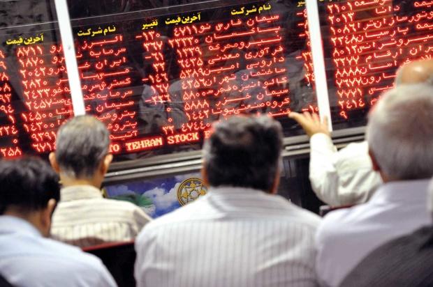

<div align="center">

</div>

> <p dir="RTL"> 
با استفاده از داده های OHLCV شرکت های تشکیل دهنده شاخص s&p500 و همچنین داده مربوط به شاخص های اقتصادی به سوالات زیر پاسخ دهید.
</p>

```{r message=FALSE, warning=FALSE}
library(stringr)
library(qcc)
library(ggbiplot)
library(EBImage)
library(highcharter)
#library(rcompanion)
library(ggplot2)
library(readr)
library(dplyr)
constituents = read.csv("../data/constituents.csv")
indexes = read.csv("../data/indexes.csv")
filenames <- list.files("../data/stock_dfs/", pattern="*.csv")
Data = data.frame()
for(filename in filenames){
  t = read_csv(paste("../data/stock_dfs/", filename, sep = "")) %>% mutate(Symbol = str_remove(filename, ".csv"))
  Data = rbind(Data, t)
}
Data %>% mutate(Year = as.integer(unlist(str_split(Date, "-"))[c(T,F,F)]) ,
                 Month = as.integer(unlist(str_split(Date, "-"))[c(F,T,F)]) ,
                 Day =  as.integer(unlist(str_split(Date, "-"))[c(F,F,T)])) -> Data
```


***

<p dir="RTL">
۱. چه شرکتی رکورددار کسب بیشترین سود در بازه یکساله، دو ساله و پنج ساله می باشد؟ این سوال را برای بخش های مختلف مورد مطالعه قرار دهید و رکورددار را معرفی کنید. (برای این کار به ستون sector داده constituents مراجعه کنید.) برای هر دو قسمت نمودار سود ده شرکت و یا بخش برتر را رسم نمایید.
</p>
```{r message=FALSE, warning=FALSE}
Data11 = Data %>% group_by(Symbol, Year) %>% summarise(Start = first(Open), End = last(Close)) %>% 
  inner_join(constituents,by = 'Symbol')

Data11 %>% mutate(Profit = End - Start) %>% arrange(-Profit) %>% group_by(Sector) %>%  filter(row_number() == 1) -> Data12
Data12 %>% View()
Data12 %>% hchart(type = 'column',hcaes(x = Sector,y = Profit)) %>% hc_add_theme(hc_theme_monokai()) %>% 
  hc_title(text = "One Year")


inner_join(Data11 %>% mutate(Year = Year - 1) %>% select(Year,Symbol,End,Sector),
           Data11 %>% select(Year,Symbol,Start,Sector),by = c('Symbol','Year','Sector')) %>%
  mutate(Profit = End - Start) %>% arrange(-Profit) %>% group_by(Sector) %>%  filter(row_number() == 1) -> Data13
Data13 %>% View()
Data13 %>% hchart(type = 'column',hcaes(x = Sector,y = Profit)) %>% hc_add_theme(hc_theme_monokai()) %>% 
  hc_title(text = "Two Year")


inner_join(Data11 %>% mutate(Year = Year - 4) %>% select(Year,Symbol,End,Sector),
           Data11 %>% select(Year,Symbol,Start,Sector),by = c('Symbol','Year','Sector')) %>%
  mutate(Profit = End - Start) %>% arrange(-Profit) %>% group_by(Sector) %>%  filter(row_number() == 1) -> Data14
Data14 %>% View()
Data14 %>% hchart(type = 'column',hcaes(x = Sector,y = Profit)) %>% hc_add_theme(hc_theme_monokai()) %>% 
  hc_title(text = "Five Year")
```
```{r,echo=FALSE}
rm(Data11)
rm(Data12)
rm(Data13)
rm(Data14)
```

***

<p dir="RTL">
۲. یک اعتقاد خرافی می گوید خرید سهام در روز سیزدهم ماه زیان آور است. این گزاره را مورد ارزیابی قرار دهید.
</p>
```{r}
t.test(
  Data %>% mutate(Profit = Close - Open) %>% filter(Day == 13) %>% .$Profit ,
  Data %>% mutate(Profit = Close - Open) %>% filter(Day != 13) %>% .$Profit )
```

***

<p dir="RTL">
۳. رکورد بیشترین گردش مالی در تاریخ بورس برای چه روزی بوده است و چرا!!!
</p>

```{r}
Data %>% mutate(MarketSize = Volume * ((High - Low)/2)) %>% group_by(Date) %>%
  summarise(MarketSize = sum(MarketSize)) %>% arrange(-MarketSize) %>% head(11) -> Data3
Data3 %>% head(10) %>% hchart(type = 'column',hcaes(x = row_number(), y = MarketSize)) %>% hc_add_theme(hc_theme_monokai()) %>% 
  hc_title(text = "Market Size") %>% hc_xAxis(categories = rbind(Data3[11,],Data3 %>% head(10))$Date)
rm(Data3)
```

***

<p dir="RTL">
۴. شاخص AAPL که نماد شرکت اپل است را در نظر بگیرید. با استفاده از رگرسیون خطی یک پیش کننده قیمت شروع (open price) بر اساس k روز قبل بسازید. بهترین انتخاب برای k چه مقداری است؟ دقت پیش بینی شما چقدر است؟
</p>

```{r,message=FALSE,warning=FALSE,}
Data4 = Data %>% filter(Symbol == "AAPL") %>% .[-c(8,9,10,11)]

Data41 = Data4
Data42 = data.frame()

for(k in 1:100){
  inner_join(Data4 %>% mutate(Date = lead(Date,k)),Data41,by = 'Date') -> Data41
  colnames(Data41)[2] <- 'Open'
  fit = lm(Open ~ ., data = Data41, na.action = na.omit)
  Data42 = rbind(Data42, data.frame(k = k, err = mean(fit$residuals^2)))
}
Data42 %>% arrange(err) %>% head() %>% 
  hchart( type = "line", hcaes(k, err))
rm(Data41)
rm(Data42)
```

***

<p dir="RTL">
۵. بر روی داده های قیمت شروع شرکت ها الگوریتم pca را اعمال کنید. نمودار تجمعی درصد واریانس بیان شده در مولفه ها را رسم کنید. سه مولفه اول چند درصد از واریانس را تبیین می کند؟
</p>
```{r}
Data5 = data.frame(Date = unique(Data$Date))
for(symbol in Data$Symbol %>% unique()){
  t = Data %>% filter(Symbol == symbol)
  t[,symbol] = t$Open
  t %>% .[,c(1,12)] %>% inner_join(Data5,by = "Date") -> Data5
}
rownames(Data5) <- Data5$Date
pca5 = prcomp(Data5[,-1], center=T, scale.=T)
hchart(data.frame(n = 1:126, var = summary(pca5)$importance[3,]), type = "line", hcaes(x = n, y = var)) %>% 
  hc_add_theme(hc_theme_monokai())

hchart(data.frame(P = 1:3 , var = summary(pca5)$importance[2,][1:3]), type = "column", hcaes(x = P, y = var)) %>%
  hc_add_theme(hc_theme_monokai())

```

***

<p dir="RTL">
۶. برای هر نماد اطلاعات بخش مربوطه را از داده constituents استخراج نمایید. برای هر بخش میانگین روزانه قیمت شروع شرکت های آن را محاسبه کنید. سپس با استفاده از میانگین به دست آمده  داده ایی با چند ستون که هر ستون یک بخش و هر سطر یک روز هست بسازید. داده مربوط را با داده شاخص های اقتصادی ادغام کنید. بر روی این داده pca بزنید و نمودار biplot آن را تفسیر کنید.
</p>
```{r}
Data2 = Data
Data2$Date = as.factor(Data$Date)
Data61 = Data2 %>% left_join(constituents, by = "Symbol") %>% group_by(Sector,Date) %>% 
  summarise(aveOpen = mean(Open)) %>% tidyr::spread(Sector,aveOpen) %>% inner_join(indexes,by = 'Date')
rownames(Data61) = Data61$Date
pca = prcomp(Data61[,-1],center = T, scale. = T)
ggbiplot(pca, obs.scale = 1, var.scale = 1,
  ellipse = TRUE, circle = TRUE)
rm(Data61)
rm(Data2)
```


***

<p dir="RTL">
۷. روی همه اطلاعات (OHLCV) سهام اپل الگوریتم PCA را اعمال کنید. سپس از مولفه اول برای پیش بینی قیمت شروع سهام در روز آینده استفاده کنید. به سوالات سوال ۴ پاسخ دهید. آیا استفاده از مولفه اول نتیجه بهتری نسبت به داده open price برای پیش بینی قیمت دارد؟
</p>
```{r}
Data71 = Data %>% filter(Symbol == 'AAPL')
rownames(Data71) = Data71$Date
Data72 = prcomp(Data71[,-c(1,8)], center=T, scale.=T) %>% .$x %>% as.data.frame() %>% select(PC1)
Data72$Open = Data71$Open
Data72$Date = Data71$Date
Data73 = data.frame()
for(k in 50:150){
  inner_join(Data72 %>% mutate(PC1k = lead(Date,k)) %>% select(Date,PC1k),Data72,by = 'Date') -> Data72
  fit = lm(data = Data72[,-1], Open~. , na.action = na.omit)
  Data73 = rbind(Data73,data.frame(k = k, err = mean(fit$residuals^2)))
}
Data73 %>% hchart( type = "line", hcaes(x = k, y = err))
rm(Data71)
rm(Data72)
rm(Data73)
```
<p dir="RTL">
میتوان دید که اختلاف زیادی وجود دارد و بهترین k برای این روش 109 میباشد.
</p>

***

<p dir="RTL">
۸. نمودار سود نسبی شاخص s&p500 را رسم کنید. آیا توزیع سود نرمال است؟(از داده indexes استفاده کنید.)
با استفاده از ده مولفه اول سوال پنج آیا می توانید سود و ضرر شاخص s&p500 را برای روز آينده پیش بینی کنید؟ از یک مدل رگرسیون لاجستیک استفاده کنید. درصد خطای پیش بینی را به دست آورید.
</p>
```{r}
indexes %>% mutate(PSP500 = lag(SP500,1)) %>% filter(row_number() != 1) %>% mutate(rel = ((SP500 - PSP500)/PSP500)) %>% 
  select(SP500,PSP500,rel,Date) -> Data81
Data81 %>% .$rel %>% hchart(type = 'hist')
shapiro.test(Data81 %>% .$rel)

Data82 = pca5$x %>% as.data.frame() %>% .[,1:10]
Data82$Date = as.Date(Data5$Date)
Data81$Date = as.Date(Data81$Date)
Data82 %>% inner_join(Data81,by = 'Date') %>% .[,-11] %>% lm(formula = rel ~ .) %>% summary()
```
<p dir="RTL"> 
میتوان با نتایج تست و نمودار گفت که نرمال میباشد.
</p>


***

<p dir="RTL"> 
۹. عکسی که در ابتدای متن آمده را در نظر بگیرید. با استفاده از pca عکس را فشرده کنید. سپس نمودار حجم عکس فشرده بر حسب تعداد مولفه اصلی را  رسم کنید. بهترین انتخاب برای انتخاب تعداد مولفه ها در جهت فشرده سازی چه عددی است؟
</p>

```{r}
pic = readImage("images/stock.jpg")
Data91 = list(pic[,,1],pic[,,2],pic[,,3])
pca9 = list(prcomp(Data91[[1]], scale=TRUE),prcomp(Data91[[2]], scale=TRUE),prcomp(Data91[[3]], scale=TRUE))
size = c()
for (k in 1:(dim(pic)[2]/10)) {
  com = 1:(k*10)
  rot = list(pca9[[1]]$rotation[,com],
             pca9[[2]]$rotation[,com],
             pca9[[3]]$rotation[,com])
  
  compact = list(t(rot[[1]]) %*% t(Data91[[1]]),
                 t(rot[[2]]) %*% t(Data91[[2]]),
                 t(rot[[3]]) %*% t(Data91[[3]]))
  
  approx = rgbImage(t(rot[[1]] %*% compact[[1]]),
                    t(rot[[2]] %*% compact[[2]]),
                    t(rot[[3]] %*% compact[[3]]))
  
  t = tempfile("", , ".jpeg")
  files = writeImage(approx, t , quality = 100)
  size = c(size, file.info(t)$size)
  if (file.exists(t)) file.remove(t)
}
hchart(data.frame(FeaturesLength = 1:k, Size = size), type = "line", hcaes(y = Size, x = FeaturesLength))

highchart() %>% 
  hc_add_series(data.frame(dim = 1:dim(pic)[2], var = summary(pca9[[1]])$importance[3,]), type = "line", hcaes(dim, var), name = "R", color = "Red") %>%
  hc_add_series(data.frame(dim = 1:dim(pic)[2], var = summary(pca9[[2]])$importance[3,]), type = "line", hcaes(dim, var), name = "G", color = "Green") %>%
  hc_add_series(data.frame(dim = 1:dim(pic)[2], var = summary(pca9[[3]])$importance[3,]), type = "line", hcaes(dim, var), name = "B", color = "Blue")

```
<p dir="RTL"> 
میتوان با این دو نمودار عدد مناسبی برای تعداد در نظر گرفت.با توجه به اینکه با زیاد شدن تعداد مولفه ها حجم زیاد میشود و با کم شدن مولفه ها واریانس کمتری مورد پوشش قرار میگیرد.
</p>

***

<p dir="RTL"> 
۱۰. پنج ایده جالبی که روی داده های مالی بالا می توانستیم پیاده کنیم را بیان کنید. (ایده کافی است نیازی به محاسبه بر روی داده نیست.)
</p>

<p dir="RTL"> 
1.بررسی گزاره های تحلیل تکنیکال در حوزه بورس
</p>g

<p dir="RTL"> 
2.مدلی برای پیش بینی شلوغی بازار بورس
</p>
<p dir="RTL"> 
3.مدلی برای پیدا کردن سوده ده ترین حوزه یا بخش در طولانی مدت
</p>
<p dir="RTL"> 
4.پیدا کردن شرکت های با سباط و غیر متعادل
</p>
<p dir="RTL"> 
5.تهیه تاریخچه مناسبی از اوج و فرود هر حوزه و بخش
</p>


